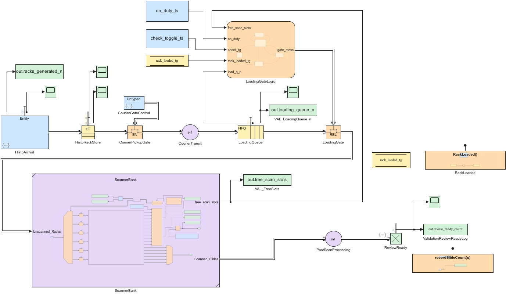
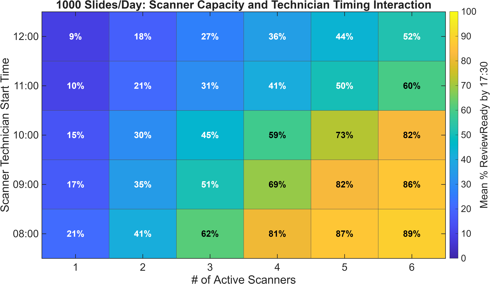

# WSI Workflow Simulation

Discrete-event simulation framework for digital pathology whole-slide imaging (WSI) workflows, implemented in MATLAB, Simulink, SimEvents, and Stateflow.

The model represents the downstream digital pathology workflow from routine H&E slide availability through rack formation, scheduled courier transport, technician-mediated scanner loading, multi-scanner dispatch, slide scanning, post-scan processing, and the `ReviewReady` endpoint.

**Current research release:** v1.2  
**Development environment:** MATLAB / Simulink R2025b  
**Status:** validated simulation architecture with pilot scenario results; not a final institutional capacity recommendation.

[Interactive Simulink Web View](https://mgbayes.github.io/wsi-workflow-simulation/) ·
[Technical model reference](docs/README_v1.2.md) ·
[Pathology Visions 2026 poster](docs/poster/Bayes_PV26_Poster_Final.pdf) ·
[Pilot results](results/v1.2-pilot/)

## Model architecture



The baseline model is organized into three reusable Simulink components:

- [`Slide_Model.slx`](Slide_Model.slx) — top-level workflow from histology output to `ReviewReady`
- [`ScannerBank.slx`](ScannerBank.slx) — enabled-fleet capacity accounting and state-aware multi-scanner dispatch
- [`GenericScanner.slx`](GenericScanner.slx) — reusable P480-style scanner abstraction

The separate [`Loader_Scanner_Model_Multi.slx`](Loader_Scanner_Model_Multi.slx) model is the validation/stress-test harness for the scanner-loading and fleet-dispatch architecture.

Detailed static diagrams are available in [`docs/diagrams/`](docs/diagrams/), including vector PDF versions.

## What the model studies

The framework is designed to examine interactions among:

- time-dependent histology output;
- courier pickup and transport timing;
- scanner technician coverage and check frequency;
- scanner fleet size and queueing;
- stochastic slide scan times;
- post-scan processing latency; and
- same-day service targets such as the percentage of slides `ReviewReady` by a specified cutoff.

The current daily experiment evaluates nominal workload levels of 500, 1000, and 2000 slides/day across 1–6 active scanners and scanner-technician start times from 08:00–12:00. Workload realizations are stochastic; the workload labels represent target mean daily volumes rather than fixed slide counts.

## Pilot result example



Additional publication figures are available in [`docs/figures/`](docs/figures/). The complete Pathology Visions 2026 poster is available as a [PDF](docs/poster/Bayes_PV26_Poster_Final.pdf).

The committed pilot results use three replications per scenario and are included for transparency, reproducibility, and demonstration of the experiment framework. They should not be interpreted as final staffing or capital recommendations.

## Repository contents

| File / directory | Purpose |
|---|---|
| `Slide_Model.slx` | Top-level digital pathology workflow |
| `ScannerBank.slx` | Six-position scanner-fleet subsystem and routing |
| `GenericScanner.slx` | Reusable single-scanner subsystem |
| `Loader_Scanner_Model_Multi.slx` | Validation model for loading and scanner-bank behavior |
| `he_case_parameters.mat` | Derived workload parameterization used by the daily scenario driver |
| `run_slide_model_daily_scenarios_v2_scannerbank_v2.m` | Canonical daily scenario / Monte Carlo driver |
| `run_loader_scanner_model_multi_stress_v1_2_final_verified.m` | Scanner-bank regression and stress-validation harness |
| `export_model_artifacts_v2.m` | Exports static model diagrams and Simulink Web View artifacts |
| `results/v1.2-pilot/` | Curated pilot CSV outputs |
| `docs/figures/` | Publication-ready pilot figures |
| `docs/diagrams/` | Static model diagrams |
| `docs/README_v1.2.md` | Detailed engineering and model reference |
| `docs/` | GitHub Pages deployment of the interactive Simulink Web View |

## Requirements

The development release was built with MATLAB / Simulink R2025b and uses:

- Simulink
- SimEvents
- Stateflow

Simulink Report Generator is needed only to regenerate the interactive Web View with `export_model_artifacts_v2.m`.

The current scripts expect the core `.slx`, `.m`, and `he_case_parameters.mat` files to remain together in the repository root.

## Running the validation harness

Before changing the scanner-bank architecture, run:

```matlab
run_loader_scanner_model_multi_stress_v1_2_final_verified
```

The harness exercises the multi-scanner routing and loading architecture under several stress conditions, including constrained capacity, sparse workload, noncontiguous enabled scanners, and multi-day execution.

## Running daily scenarios

Run:

```matlab
run_slide_model_daily_scenarios_v2_scannerbank_v2
```

The driver supports three modes:

```matlab
run_mode = "smoke";       % quick structural / workflow check
run_mode = "pilot";       % 3 replications per scenario
run_mode = "production";  % 30 replications per scenario
```

Generated working outputs are written to `daily_scenario_outputs/`. Curated pilot outputs used for the current research release are stored separately under [`results/v1.2-pilot/`](results/v1.2-pilot/).

## Workload data and privacy

The original institutional slide-level dataset is **not included** in this repository.

`he_case_parameters.mat` contains derived/deidentified workload parameters used to generate synthetic routine H&E workloads. Simulation outputs represent synthetic workload realizations, not individual patient cases.

For additional details on workload construction and validation, see [`docs/HistoArrival_Requirements.md`](docs/HistoArrival_Requirements.md).

## Model scope and interpretation

Version 1.2 is a research simulation framework. Several values remain configurable modeling assumptions or provisional parameters, including scanner service-time and post-scan latency distributions.

The model currently ends at `ReviewReady`: a newly scanned slide has completed the modeled post-scan latency and is available for review. It does not model pathologist interpretation, case sign-out, case completeness, or later archive retrieval.

Regression tests establish model behavior. Operational recommendations require appropriate empirical inputs, scenario assumptions, and adequately replicated production experiments.

## Documentation and related material

- [Interactive Simulink Web View](https://mgbayes.github.io/wsi-workflow-simulation/)
- [Detailed v1.2 model reference](docs/README_v1.2.md)
- [HistoArrival methodology and validation](docs/HistoArrival_Requirements.md)
- [Static model diagrams](docs/diagrams/)
- [Pilot figures](docs/figures/)
- [Pilot results](results/v1.2-pilot/)
- [Pathology Visions 2026 poster](docs/poster/Bayes_PV26_Poster_Final.pdf)

## License

This project is released under the [MIT License](LICENSE).
